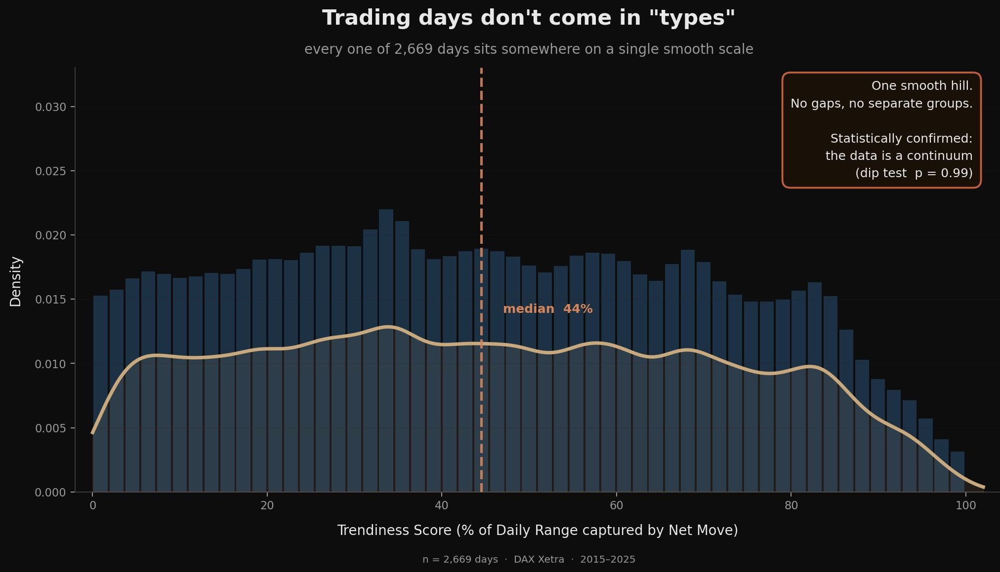
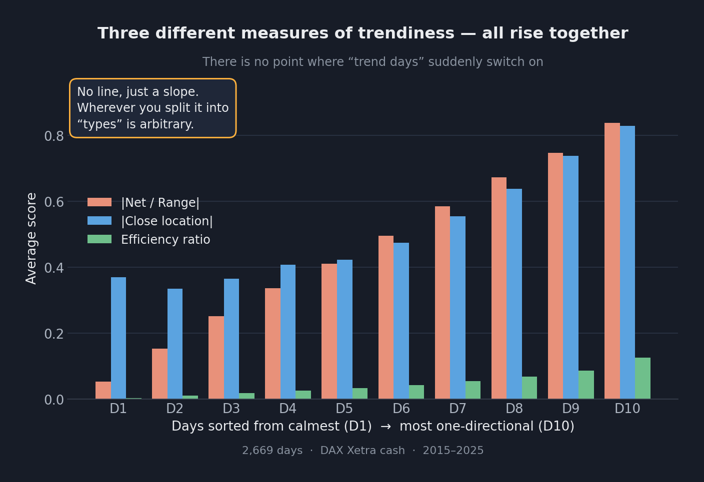
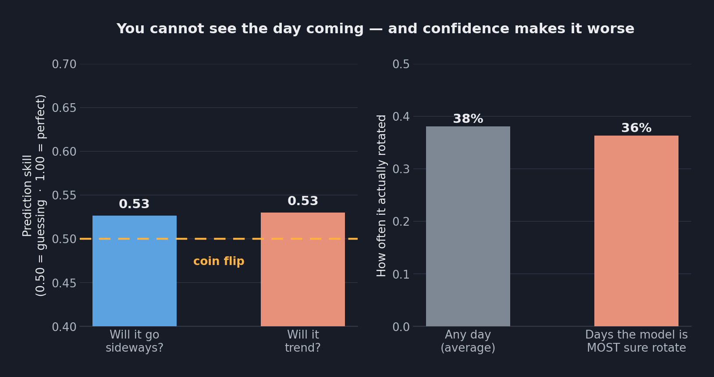
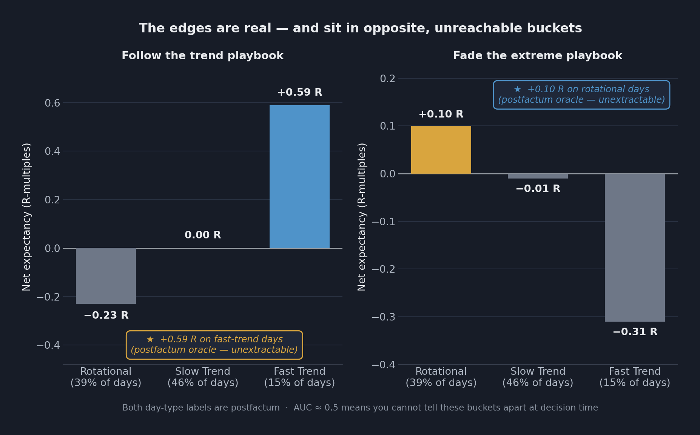
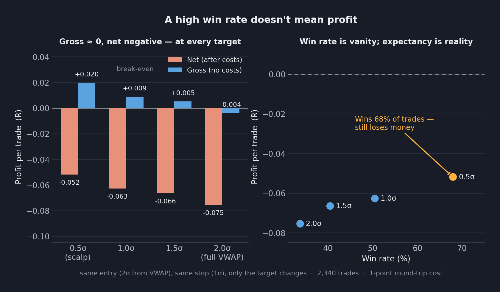
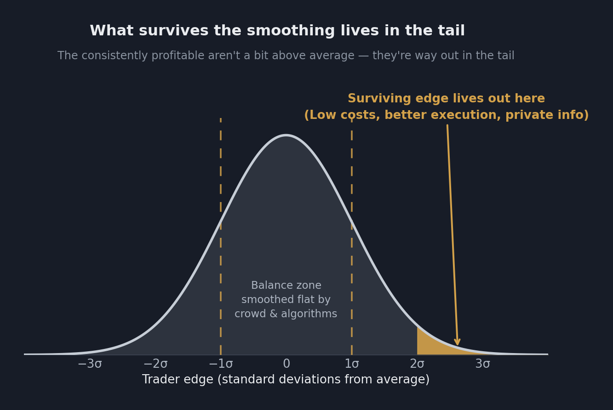
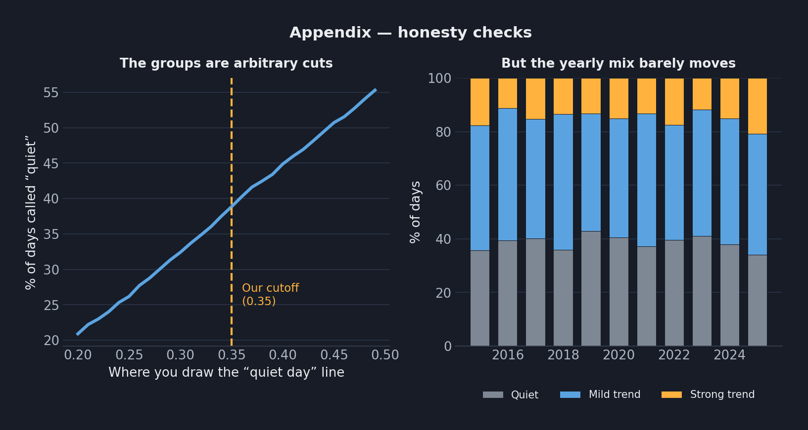

# Retail Trading Is a Coin Flip — and 10 Years of DAX Prove It

*Why every edge eventually gets arbitraged into a rounding error — shown on 2,669 trading days, not vibes.*

---

The arc is always the same. You buy a $500 prop account, catch a run, pull out a few thousand. You blow a couple more accounts and you're *still* net positive, because one payout dwarfs the fees. It feels like skill.

Then the firm tightens the rules or slow-walks your withdrawal, and you move to a real broker. That's where the math catches up: no oversized payout to absorb the damage anymore — every losing trade is your own money, with nothing on the other side to win it back.

This isn't about discipline or psychology or a better strategy. It's colder: **the market is structured so the average participant cannot win** — not "usually doesn't," *cannot*, for the same reason a casino doesn't need to cheat. Any real edge attracts the traders and algorithms who also found it, and they compete it down to break-even, then to cost.

So I went looking in the data: **ten years of DAX, 2,669 trading days, one-minute bars.** The most basic question a trader can ask — *can you tell, in real time, what kind of day you're in, and trade it for a profit?*

Spoiler: no. And *how* it's no is more interesting than the no.

---

## The data, so you know it's real

DAX index, one-minute bars from Dukascopy, 2015 → 2025, 2,669 trading days, regular cash session (09:00–17:30 Berlin). Everything below is computed from that — every chart is reproducible from the scripts at the bottom.

One honest caveat: this is a CFD on the index, and its "volume" is tick volume — a proxy, not real exchange volume. It changes nothing here (the questions are about price), but you should know it.

---

## 1. It starts with a comforting idea: that days have "types"

Almost every retail trading framework rests on one assumption: that a session has a *kind*. A trend day. A range day. A reversal day. The taxonomy itself is old and respectable — in Steidlmayer's *Market Profile*, Jim Dalton names these day-types as a *descriptive* vocabulary, a way to label a session **after** it has formed. That's a fair use, and not what I'm arguing with. The problem is the next move retail makes with it — *recognize the kind early, switch to the matching playbook, win* — which smuggles in two things the descriptive version never claimed: that the types are **discrete** to begin with, and that you can **know which one you're in while it still matters**. This section tests the first; Section 3 tests the second.

Take the first one. Before you can trade "trend days," they have to *exist* as a distinct thing. So I measured it. For each day I took the **share of its daily range captured by the net move** (|net move| ÷ daily range — near 1 when the day went one way cleanly, near 0 when it churned back to where it started), and plotted all 2,669.



It's one smooth hill. A Hartigan dip test (which checks for exactly the kind of valley you'd see between two real groups) returns *p* = 0.99: **statistically, there is no valley.** No gaps, no natural seams, no clusters. "Trend days" and "range days" aren't categories the market hands you — they're slices you draw, by hand, through a continuous gradient.

This is also why clustering algorithms "find" day-types and mislead people. **k-means is mathematically flawless — that's the problem.** Feed it a smooth black-to-white gradient and ask for two clusters: it splits down the middle, filing 49%-grey under "black" and 51%-grey under "white" — pixels your eye can't tell apart — while that 51% pixel sits in the same cluster as pure white. The split is valid and meaningless. k-means always returns *k* clusters; the boundary is the algorithm's, not the data's.

**The market is a fluid.** Everything below follows from accepting that.

---

## 2. Fine — measure it instead of labeling it

If it's a continuum, the honest move is to *score* trendiness, not slap a label on it. And the gradient holds from every angle: sort the days from calmest to most one-directional, and three independent measures of trendiness climb together smoothly, with no step anywhere.



So we can absolutely *measure* how trending a day was. The question that decides whether you can make money is sharper: can you measure it **while it still matters** — early enough to act?

---

## 3. The coin flip

Here's the part the title promised.

I gave a model everything available by **noon** — the whole morning's price action, range, position, how choppy it had been — and asked it to predict the **rest of the day** (a clean split: the model only sees the past, the label only covers the future, so there's no cheating). Two questions, the obvious ones a trader needs answered: *will the rest of the day trend, or just rotate?*



Both answers land at a prediction skill of **0.53**, where 0.50 is a coin flip. The character of the afternoon is, to a first approximation, **unknowable from the morning.**

And it gets worse — look at the right panel. When the model is *most confident* a day will rotate, it's right **36%** of the time, *below* the 38% base rate. The predictions it's proudest of are the ones you should trust least.

This is the whole game. Every strategy that says "in a trending market do X, in a ranging market do Y" quietly assumes you can tell which one you're in. You can't. Not reliably, not in time. **It's a coin flip with extra steps.**

---

## 4. Both playbooks are real — and both are traps

"But trend-following *works*," you say. "And mean-reversion *works*." Here's the uncomfortable truth: they both do — in exactly the place you can't reach.

Split the days by type *after the fact* and trade each playbook. Trend-following genuinely earns **+0.59 R** (+58 DAX points) on fast-trend days; fading genuinely earns **+0.10 R** on rotational days. The money is *right there* in the data.



They're perfect mirror images — each one profitable precisely where the other bleeds. And both are unreachable for the same reason as Section 3: **you can't tell which bucket you're in until the day is over** (that 0.53 coin flip again).

That label "after the fact" is doing heavy lifting, and it's where most backtests quietly lie to their authors. A day gets *called* a fast-trend day because it trended all day — *including the part after you'd have entered.* "Just trade the trend days" really means "just trade the days that worked," which requires a time machine.

And then there's the metric retail loves most: win rate. Watch what happens when you fade extremes and vary only the profit target:



Before costs, every version of the trade is break-even. After a single point of cost, every version loses. The punchline sits on the left: the tightest scalp **wins 68% of its trades and still loses money.** That equity curve looks gorgeous in a screenshot and bleeds in a brokerage statement.

> **Win rate is what you show investors. Expectancy is what the broker counts.**

---

## 5. Why the edge always dies

So why does this keep happening — to every retail trader, on every strategy, eventually?

Picture the skill of every market participant as a bell curve. Every trader and every algorithm is, collectively, an arbitrage machine: each one that finds a sliver of edge trades it away, dragging the whole distribution toward the average. The follow edge, the fade edge — both got ground down to ≈ 0 in the data because that machine already ate them.



What survives is a layer so thin that only the far tail can extract it — the players with the **lowest costs**, the **fastest execution**, or genuine **private information**. The consistently profitable aren't a little above average. They're way out in the tail, because the middle has been smoothed flat. (A calibration note, because honesty is the point: "3 sigma" is an illustration, not a measured constant — studies of day traders put the consistently profitable at roughly **1–3%**, about 2–2.5σ.)

And the tail can never be smoothed all the way to zero — that's the **Grossman–Stiglitz paradox**. If markets were *perfectly* efficient, no one would be paid to gather information, so no one would, so prices couldn't stay efficient. A thin, irreducible edge has to remain to pay the few who are best at extracting it. Efficiency doesn't mean the edge is zero; it means it's exactly as small as it can be while still paying its best harvesters — and you are almost certainly not being paid.

This is also the answer to the prop-firm arc at the top. On a prop account the payout structure *masks* the math: one big withdrawal hides a string of blown accounts, and it feels like a system. A real broker strips the mask off. There's no asymmetric payout to hide behind — just your edge against everyone else's, and for the average participant that edge is a rounding error that costs turn negative.

---

## 6. What this actually means for you

Trading is a probability game barely distinguishable from a coin flip. To come out ahead over distance you don't need confidence, or a guru, or a cleaner chart — you need a **structural edge over the other participants**: lower costs, better execution, faster information, or a genuine statistical advantage that survives them all finding it too. Almost no retail setup has any of these.

And the cruelest part is built in: the moment a real loophole appears, it starts attracting the very people who close it. By the time it's on YouTube, it's break-even. By the time it's in a $500 course, it's a cost. **The appearance of an edge guarantees its disappearance.**

None of this says markets are random noise — they have rich structure, as Sections 1–4 show. It says the structure is *inseparable from noise at the moment you have to decide,* and costs eat whatever leaks through. The patterns are real. The edge is in the tail. Most of us — including the version of me that started this — are standing in the middle, flipping a coin and calling it skill.

---

## Limitations

Read this as a lab notebook, not a peer-reviewed paper — an honest first pass, open about its limits:

- **One instrument.** DAX only; results may not transfer to other markets.
- **Proxy volume.** Dukascopy CFD tick volume, not real contract volume.
- **Cost assumption.** A flat 1-point round-trip; no slippage or latency model (both make the picture *worse*, not better).
- **Validation.** There's an in-sample / out-of-sample split, but no rolling walk-forward.
- **One setup family.** Two playbooks tested out of an infinite space — which also means multiple-testing risk: torture enough variants and one looks profitable by chance.

None of these change the qualitative finding; all of them should temper any precise number.

---

## Reproduce it yourself

```
.
├── README.md
├── dax_trend_expectancy.py        # session segmentation, trendiness score, follow expectancy
├── step1_balance_detectability.py # Section 3: can you predict the day in real time? (AUC)
├── step2_fade_backtest.py         # Section 4: unconditional fade expectancy
├── step2b_fade_sweep.py           # Section 4: fade target-geometry robustness sweep
└── figures/
```

Data via `dukascopy-node`:

```bash
npx dukascopy-node -i deuidxeur -from 2015-01-01 -to 2025-06-01 -t m1 -f csv -v --cache
```

All scripts are pure Python (pandas / numpy / scikit-learn / diptest / matplotlib).

---

## Appendix — the honesty checks



**Left:** the share of days you call "rotational" depends entirely on where you draw the cutoff (26% at 0.25 → 51% at 0.45) — proof, in one chart, that the buckets are arbitrary slices of a gradient. **Right:** the regime mix is nonetheless remarkably stable year to year, which is partly why "what happened recently" adds nothing to the noon prediction — at the yearly scale there's little to predict. (Stability across years doesn't rule out week-scale clustering, which this view averages out.)

---

*If this was useful or interesting, a ⭐ helps others find it.*
